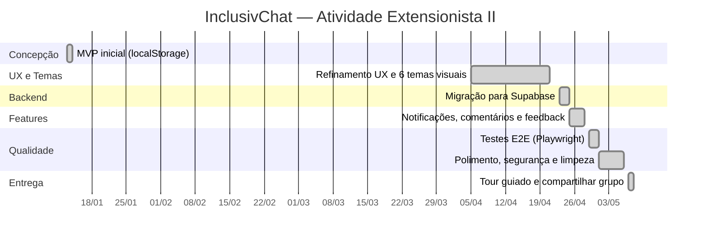

# 📅 Cronograma de Desenvolvimento — InclusivChat

Relação das fases do projeto com período, duração e principais entregas. O cronograma foi extraído do histórico de commits do repositório.

## Diagrama de Gantt



## Tabela detalhada

| Fase | Período | Dias | Principais entregas |
|---|---|---|---|
| **Concepção e MVP** | 13/jan | 1 | Estrutura inicial em React + Vite, armazenamento em localStorage, telas de login/cadastro/feed |
| **Refinamento UX e Temas Visuais** | 05/abr – 20/abr | 16 | 6 temas (Lua Serena, Floresta Encantada, Céu Suave, Coração Mágico, Amanhecer Lilás, Pétala Rosa), sistema de recompensas, redesign da logo, navegação por abas, decorações por tema, cadastro de plataformas |
| **Migração para Supabase** | 23/abr – 24/abr | 2 | PostgreSQL + Auth + Realtime, políticas RLS em todas as tabelas, refatoração completa do acesso a dados |
| **Notificações, Comentários e Feedback** | 25/abr – 27/abr | 3 | Sino de notificações com Realtime, edição/exclusão inline de comentários, formulário de feedback com estrelas e categorias |
| **Testes E2E** | 29/abr – 30/abr | 2 | Suíte Playwright com 11 testes (smoke + autenticados + fixtures), correção de bug crítico (`updateUser` não definido), cooldown de essências |
| **Polimento e Segurança** | 01/mai – 05/mai | 5 | Limpeza de comentários, remoção de código morto e dependências fantasmas, reescrita do README, sanitização de variáveis de ambiente, fix de contraste no modo escuro mobile |
| **Tour Guiado e Compartilhar Grupo** | 07/mai | 1 | Componente `Tour` com 5 slides reabrível via FAQ, botão de compartilhar grupo no feed com card visual no `PostCard` |
| **Total efetivo** | — | **30 dias** | — |

> **Observação:** entre 13/jan e 05/abr há uma pausa de aproximadamente 12 semanas (período letivo dedicado a outras atividades). O projeto foi efetivamente desenvolvido em ~30 dias úteis distribuídos em dois sprints.

## Linha do tempo simplificada

```
JAN ─┬─ 13/01  MVP inicial
     │
     │  (pausa - 12 semanas)
     │
ABR ─┼─ 05–20  Refinamento UX e temas (16 dias)
     ├─ 23–24  Migração para Supabase (2 dias)
     ├─ 25–27  Notificações e feedback (3 dias)
     └─ 29–30  Testes E2E (2 dias)

MAI ─┬─ 01–05  Polimento e segurança (5 dias)
     └─ 07     Tour guiado + compartilhar grupo (1 dia)
```
